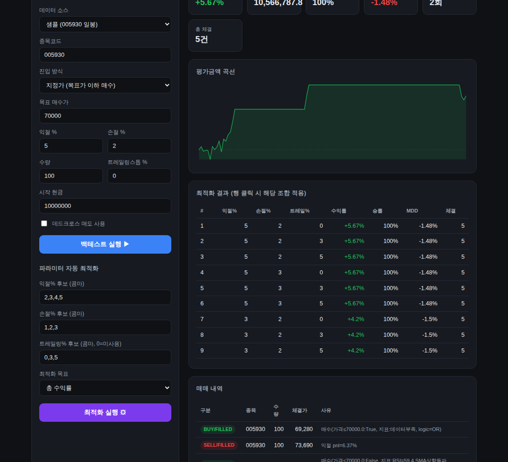

# AIbot — 자동 주식 매매 프로그램 (모의투자 뼈대)

기준치 값에서 **자동 매수·자동 매도**가 이루어지는 자동매매 프로그램입니다.
증권사를 자유롭게 갈아끼울 수 있는 **어댑터 구조**와 **지정가 + 지표(이평선/RSI) 조합 전략**을 갖췄고,
실제 증권사 API 없이도 바로 검증할 수 있는 **모의투자(PaperBroker)** 부터 완성되어 있습니다.

## ⚠️ 먼저 알아둘 점 (증권사 API 현실)

| 증권사 (프로그램) | 개인용 공개 자동매매 API | 이 프로젝트에서 |
|---|---|---|
| NH투자증권 (나무) | 제공 (Open API + 모의투자) | `nh` 어댑터 골격 준비 — 키 발급 후 구현 |
| 메리츠증권 | 제한적/불확실 — **직접 확인 필요** | `meritz` 어댑터 골격(가용성 확인 안내) |
| 신한투자증권 | 제한적/불확실 — **직접 확인 필요** | `shinhan` 어댑터 골격(가용성 확인 안내) |
| 한국투자증권(KIS)·키움 | 제공(문서·예제 풍부) | 참고: 자동매매 API가 가장 탄탄한 편 |

> "영웅문/나무 화면을 자동 클릭"하는 매크로 방식은 약관 위반 소지와 불안정성 때문에 권장하지 않습니다.
> 정석은 각 증권사의 **공식 Open API**로 별도 프로그램이 직접 주문을 넣는 방식입니다.

### 법적/안전 유의사항
- **본인 계좌** 자동매매는 일반적으로 허용되나, 이를 **타인에게 서비스로 제공**하면 자본시장법상 투자일임업 인가 문제가 생깁니다(본인용으로만 사용).
- 실계좌 연결 전, 반드시 **모의투자 계좌**로 충분히 검증하세요.
- 인증정보(APP KEY 등)는 **절대 커밋하지 마세요**(`.gitignore`에 `config.yaml`, `.env` 포함).

## 구조

```
autotrader/
├── models.py              # 주문/포지션/시세 등 공통 자료구조
├── market_data.py         # 시세 피드(랜덤워크/재생)
├── engine.py              # 시세→신호→주문 루프
├── config.py              # YAML 설정 로더
├── brokers/
│   ├── base.py            # BrokerAdapter 인터페이스(증권사 공통 규약)
│   ├── paper.py           # PaperBroker(모의투자 시뮬레이터) ✅ 동작
│   ├── nh.py              # 나무(NH) 어댑터 골격
│   ├── meritz.py          # 메리츠 어댑터 골격
│   └── shinhan.py         # 신한 어댑터 골격
└── strategy/
    ├── base.py            # 전략 인터페이스/신호 타입
    ├── indicators.py      # SMA, RSI, 이평 상향돌파
    └── rule_engine.py     # 지정가 + 지표 조합 규칙 전략
```

## 실행

```bash
# (선택) 의존성 설치 — 데모/테스트는 표준 라이브러리만으로도 동작
pip install -r requirements.txt

# 1) 내장 데모(랜덤워크 시세로 모의 매매)
python main.py --demo --steps 300

# 2) 설정 파일로 실행
cp config.example.yaml config.yaml   # 값 수정 후
python main.py --config config.yaml

# 3) HTML 리포트(랜덤워크 데모)
python main.py --report result.html --steps 400

# 4) 실제 과거 주가 CSV로 백테스트
#    지정가 진입: 70000 이하 매수, +3% 익절 / -2% 손절
python main.py --csv 005930=data/sample_005930.csv --target 70000 --tp 3 --sl 2 --qty 100 --report result.html
#    지표 진입(목표가 생략 시 RSI/이평 돌파로 진입)
python main.py --csv 005930=data/sample_005930.csv --tp 4 --sl 2 --report result.html
#    여러 종목 동시
python main.py --csv 005930=samsung.csv --csv 000660=hynix.csv --report result.html

# 5) 파라미터 자동 최적화 (익절/손절/트레일링 조합 자동 탐색)
python main.py --optimize --tp-grid 2,3,4,5 --sl-grid 1,2,3 --ts-grid 0,3,5 --target 70000 --qty 100
#   실제 CSV로: --csv 005930=samsung.csv 추가
#   목표 지표: --objective return | return_dd(위험조정) | winrate

# 6) 웹 대시보드 (브라우저에서 클릭으로 조작)
python -m autotrader.webapp        # http://127.0.0.1:8000 접속
#   → 데이터소스/목표가/익절·손절/트레일링스톱을 화면에서 조절하고
#     '백테스트 실행'을 누르면 수익곡선·통계·매매내역이 즉시 표시됩니다.
#     추가 패키지 설치가 필요 없습니다(파이썬 표준 라이브러리만 사용).

# 테스트
python -m pytest -q
```

## 웹 대시보드



```bash
python -m autotrader.webapp --port 8000
```
- **데이터 소스**: 샘플(005930) · CSV 업로드 · 랜덤워크 데모
- **화면에서 조절**: 진입방식(지정가/지표), 목표가, 익절%, 손절%, 수량, 트레일링스톱%, 데드크로스 매도, 시작현금
- 실행 즉시 **수익곡선 + 통계카드(수익률/승률/MDD) + 매매내역**을 시각화
- **파라미터 자동 최적화**: 익절/손절/트레일링 후보를 넣고 '최적화 실행' → 성과순 순위표, 행 클릭 시 그 조합이 바로 적용·재실행
- 파이썬 표준 라이브러리만 사용 → `pip install` 없이 바로 실행

## 전략 강화 옵션

| 옵션 | 설명 |
|---|---|
| `take_profit_pct` / `stop_loss_pct` | 익절 / 손절 기준(%) |
| `trailing_stop_pct` | 트레일링 스톱 — 보유 중 **고점 대비** 이만큼 하락하면 매도(0=비활성) |
| `use_sma_cross` | 이동평균 **상향 돌파(골든크로스)** 매수 |
| `use_sma_cross_exit` | 이동평균 **하향 이탈(데드크로스)** 매도 |
| `use_rsi` | RSI 과매도 매수 / 과매수 매도 |
| `buy_logic` | 가격조건과 지표조건의 결합(`AND`/`OR`) |

### CSV 형식
네이버 금융 / KRX / 야후파이낸스에서 받은 일봉 CSV를 그대로 쓸 수 있습니다.
`날짜`·`종가` 컬럼명을 자동 인식하고(`Date`/`Close`/`종가` 등), `"72,000"` 같은 콤마도 처리합니다.
`data/sample_005930.csv`가 예시 형식입니다.

```
Date,Open,High,Low,Close,Volume
2024-01-02,69940,69970,69240,69280,17384713
...
```

## 전략 동작 방식 (지정가 + 지표 조합)

**매수**(미보유 시):
- 가격 조건: `현재가 ≤ 목표매수가(target_buy_price)`
- 지표 조건: `RSI < 과매도선` 또는 `이동평균 상향돌파`
- 둘을 `buy_logic`(`AND`/`OR`)으로 결합

**매도**(보유 시, 아래 중 하나라도 만족):
- 익절: `평가손익률 ≥ take_profit_pct`
- 손절: `평가손익률 ≤ -stop_loss_pct`
- 지표: `RSI > 과매수선`

종목별 파라미터는 `config.yaml`의 `rules`에서 조정합니다.

## 실제 증권사 연결하기 (다음 단계)

1. 사용할 증권사에서 Open API 신청 → APP KEY/SECRET, 계좌번호 발급
2. 해당 어댑터(`brokers/nh.py` 등)의 `connect`/`get_quote`/`place_order`를 API 호출로 구현
3. 인증정보는 환경변수 또는 커밋되지 않는 `config.yaml`로 주입
4. **모의투자 계좌**로 검증 → 이후 실계좌 소액으로 단계적 적용
